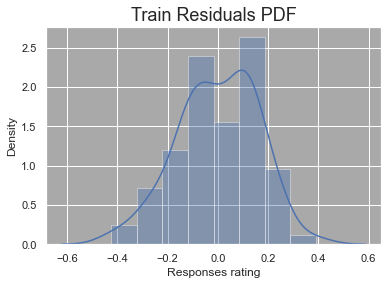

# InterviewAnalysis
## 🛈 Background Information
Lebron James is unquestionably one of the greatest basketball players to ever live. He entered stardom during his high basketball career when he was deemed, 'The Chosen One'. Then drafted directly out of high school by his hometown team, the Cleveland Cavaliers, the storybook was written for him. Despite unfathomable expectations, James has exceeded them all; most recently, he became the NBA all-time leading scorer. Categorized as a 'team first' player, Lebron has always been known to make the correct basketball decision. This unselfish behavior is also reflected in his off-court behavior and sentiment in interviews. Lebron James is a class act of a player and human. 

The best interviews occur when the spotlight is brightest and Lebron has been in many of these moments. He has been voted to the NBA All-Star team for 19 consecutive seasons, only missing out on the team his rookie year. James has competed in the NBA Finals 10 times. He has an overall record of 22 wins and 33 losses, resulting in four championship titles. 

## 🎯 Aim
We aim to perform various forms of sentiment analysis on interviews with Lebron James. 

First, we aim to identify themes in James' ASG interviews. The All-Star game is a unique experience which should consist of varying topics and trends of the year. 

Next, we will perform feature analysis and identify the strongest predictors of Lebron's tone during the NBA Finals. These are the big moments; this is where remaining poised and leading the team is most impactful! 

Finally, we test and optimize various ML models to predict Lebron's tone on a test set of data. How well can our models predict tone with limitations to factors and a small sample size? 

## :robot: ChatGPT

## :mag_right: Interview Source
http://www.asapsports.com/show_player.php?id=13888

## 📁 Datasets
**Raw data**

[Question tones](https://github.com/BryceDecker/InterviewAnalysis/blob/main/Data_sets/Question_tones.csv), [Response tones](https://github.com/BryceDecker/InterviewAnalysis/blob/main/Data_sets/Response_tones.csv), and [Tone ratings](https://github.com/BryceDecker/InterviewAnalysis/blob/main/Data_sets/raw/Interview_Tone_Rating.csv)

**Clean data**

[Interview data](https://github.com/BryceDecker/InterviewAnalysis/blob/main/Data_sets/clean/Interview_analysis_final.csv)

## 📊 Data Visualization
**Word Cloud**

 

**Linear Regression**

 

**Feature Analysis**

**Multivariate Regression**

  

 

**ML Accuracy**

**Confusion Matrices**

 
  

## :bookmark_tabs: Results

## :closed_book: Concluding Statements
