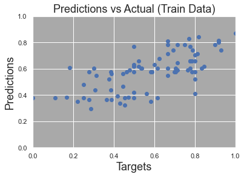
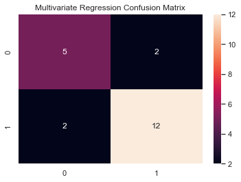
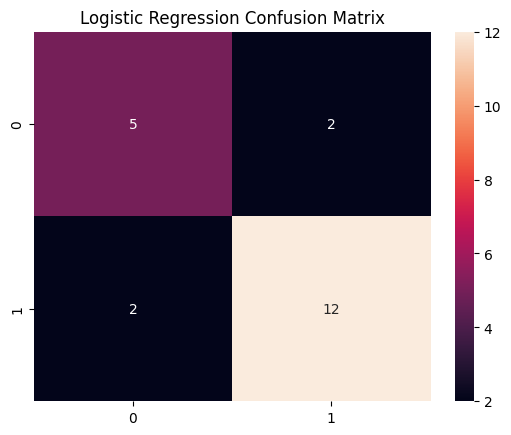

# InterviewAnalysis
## 🛈 Background Information
Lebron James is unquestionably one of the greatest basketball players to ever live. He entered stardom during his high basketball career when he was deemed, 'The Chosen One'. Then drafted directly out of high school by his hometown team, the Cleveland Cavaliers, the storybook was written for him. Despite unfathomable expectations, James has exceeded them all; in 2023, he became the NBA all-time leading scorer. Categorized as a 'team first' player, Lebron has always been known to make the correct basketball decision. This unselfish behavior is also reflected in his off-court behavior and sentiment in interviews. Lebron James is a class act of a player and human. 

The best interviews occur when the spotlight is brightest and Lebron has been in many of these moments. He has been voted to the NBA All-Star team for 19 consecutive seasons, only missing out on the team his rookie year. James has competed in the NBA Finals 10 times. He has an overall record of 22 wins and 33 losses, resulting in four championship titles. 

## 🎯 Aim
We aim to perform various forms of sentiment analysis on interviews with Lebron James. 

First, we aim to identify themes in James' ASG interviews. The All-Star game is a unique experience which should consist of varying topics and trends of the year. 

Next, we will conduct sentiment analysis of Lebron's tone from interviews during the NBA Finals. These are the big moments; this is where remaining poised and leading the team is most impactful! 

Finally, we test and optimize various ML models for binary classification where we predict Lebron's tone on a test set of data. How well can our models predict tone with limitations to factors and a small sample size? 

## :robot: ChatGPT
Prompt testing was initially performed on openai's website. We found most consistent results when submitting batches of size 5. After a consistent return from our prompt, we integrated ChatGPT into Python and identified the tone of over 2,000 questions and responses. 

Prompt: "Let 1 = positive, 0 = neutral, and -1 = negative. Identify the tone of the 5 questions using the given values. Output the list of values in order of the questions." 

(note: we used loops to change the prompt based on the number of questions submitted, originally an f-string was used to always determine the number of questions-however, this resulted in higher token usage.)

## :mag_right: Interview Source
http://www.asapsports.com/show_player.php?id=13888

## 📁 Datasets
**Raw data**

[All Transcripts](https://github.com/BryceDecker/InterviewAnalysis/blob/main/Data_sets/raw/all_text.json), [Question tones](https://github.com/BryceDecker/InterviewAnalysis/blob/main/Data_sets/raw/Question_tones.csv), [Response tones](https://github.com/BryceDecker/InterviewAnalysis/blob/main/Data_sets/raw/Response_tones.csv), and [Tone ratings](https://github.com/BryceDecker/InterviewAnalysis/blob/main/Data_sets/raw/Interview_Tone_Rating.csv)

**Clean data**

[Interview data](https://github.com/BryceDecker/InterviewAnalysis/blob/main/Data_sets/clean/Interview_analysis_final.csv)

## 📊 Data Visualization
**Word Cloud**

 

**Linear Regression**

 

**Multivariate Regression**

  

  

**ML Accuracy**

**Confusion Matrices**

 
  

## :bookmark_tabs: Results

Word Cloud

The two most common words were 'team' and 'guy'. Some notable appearances are Kyrie and Kobe. Lastly, we see 'great', 'time', and 'always' in larger than average font.

Sentiment Analysis

Linear regression performed on 'response rating' and 'question rating' resulted in an R^2 value of .271. Our features with the strongest relationship to Lebron James' response rating were 'cumulative wins', 'cumulative losses', 'win', and 'loss' resulting in an adjusted R^2 score of .419 when regressional analysis was performed. A Durbin-Watson score of 2.125 and an F-statistic of 19.38. Binary classification utilizing same features we obtained an accuracy score of 80.95%.

Binary Classification

SVC, LR, and KNN were regularly our top performing techniques. Ultimatively, we saw accuracy ranging from 70% up to 90%+ on the train and test data. For our selected random state, we obtained 80.95% accuracy using our LR and KNN models and 76.19% accuracy using the SVC model on our test data.

## :closed_book: Concluding Statements

Word Cloud

All- Star Game interviews were chosen in anticipation of different themes than those from the post-season. Our results offer us some insight into these themes, but our most common words are on track with a typical interview with James. Lebron often refers to himself as a 'guy' or 'just a guy' to remind people he is human. Also, he is viewed as one of the best players in history and his 'team' first approach has been evident throughout his entire career. Kyrie and Lebron teamed up in Cleveland for a few years and won a championship together. As for Kobe him and Lebron had some what of a rivalry as Kobe is also considered one of the all-time greats. Additionally, Kobe's tragic passing in 2020 influences his mention as well. Lastly, we see 'great', 'time', and 'always' piecing together a common expression of enjoyment during ASG weekend and being able to take a break from regular season activities.

Sentiment Analysis

While it was interesting to evaluate the linear relationship between response and question ratings, the results were less than fruitful. However, our multivariate regression had an acceptable adjusted R^2 score - by social sciences standards. Our Durbin-Watson score indicates low multicollinearity and the F-statistic is large enough to imply that our model is significant. This accuracy score will go on to equal the best score of 6 different ML binary classification methods. Ultimately, we may conclude successful results given our limited sample size and available features.

Binary Classification

With our data set on the smaller size we identified logistic regression (LR) and SVC as viable methods. We tested eight unique binary classification methods to identify the best performing ones. SVC, LR, and KNN were regularly our top performing techniques. When evaluating results on different random states (for test-train-split), we identified a trend between test data which had larger amounts of 'more positive' data points and better the accuracy on the test data set. Our small sample size created more variability in our test results. However, in the majority of cases we obtained accuracy scores of around 75-85% for the top performing methods. Predicting Lebron's tone as 'more neutral' or 'more positive' is a complex task and these results are better than expected.

