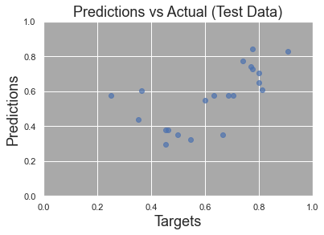
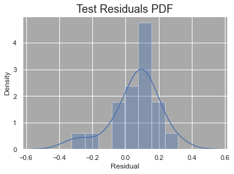

# InterviewAnalysis
## 	:warning: Disclaimer
The purpose of this repository is to aggregate and summarize three projects centered around Lebron James. Here you can find the code files (in their entirety), data sets, and a summary of each project. For more comprehensive explanations and additional details, I invite you to visit the dedicated pages of each project: [Word Cloud](https://github.com/BryceDecker/WordCloud), [Sentiment Analysis](https://github.com/BryceDecker/SentimentAnalysis), and [Binary Classification](https://github.com/BryceDecker/BinaryClassification). There, you will find in-depth information and insights regarding each topic.

## 🛈 Background Information
LeBron James undeniably stands among the greatest basketball players of all time. His journey to stardom commenced during his high school basketball career, where he earned the nickname, 'The Chosen One.' Being drafted straight out of high school by his hometown team, the Cleveland Cavaliers, added a touch of serendipity to his story. Despite immense expectations, James has consistently surpassed them, achieving the remarkable feat of becoming the NBA's all-time leading scorer in 2023. Renowned for his 'team first' mentality, LeBron has consistently demonstrated a knack for making the right basketball decisions. This selflessness extends beyond the court and is evident in his off-court behavior and the sentiments expressed in his interviews. LeBron James exemplifies both an exceptional player and an exemplary human being.

The best interviews occur when the spotlight is brightest and Lebron has been in many of these moments. He has been voted to the NBA All-Star team for 19 consecutive seasons, only missing out on the team his rookie year. Additionally, James has competed in the NBA Finals 10 times, culminating in four championship victories out of his 22 wins and 33 losses overall.

## 🎯 Aim
First, we aim to identify themes in James' All-Star game interviews. The ASG is a unique experience which should consist of varying topics and trends of the year. 

Next, we will conduct sentiment analysis of Lebron's tone from interviews during the NBA Finals. These are the big moments; this is where remaining poised and leading the team is most impactful! 

Finally, we test and optimize various ML models for binary classification where we predict Lebron's tone on a test set of data. How well can our models predict tone with limitations to factors and a small sample size? 

## :robot: ChatGPT
Prompt testing was initially performed on openai's website. We found most consistent results when submitting batches of 5 questions/responses. After a consistent return from our prompt, we integrated ChatGPT into Python and identified the tone of over 2,000 questions and responses. 

Prompt: "Let 1 = positive, 0 = neutral, and -1 = negative. Identify the tone of the 5 questions using the given values. Output the list of values in order of the questions." 

## :mag_right: Interview Source
http://www.asapsports.com/show_player.php?id=13888

## 📁 Datasets
**Raw data**

[All transcripts](https://github.com/BryceDecker/InterviewAnalysis/blob/main/Data_sets/raw/all_text.json), [Question tones](https://github.com/BryceDecker/InterviewAnalysis/blob/main/Data_sets/raw/Question_tones.csv), [Response tones](https://github.com/BryceDecker/InterviewAnalysis/blob/main/Data_sets/raw/Response_tones.csv), and [Tone ratings](https://github.com/BryceDecker/InterviewAnalysis/blob/main/Data_sets/raw/Interview_Tone_Rating.csv)

**Clean data**

[Interview data](https://github.com/BryceDecker/InterviewAnalysis/blob/main/Data_sets/clean/Interview_analysis_final.csv)

## 📊 Data Visualization
**Word Cloud**

 

**Linear Regression**

 

**Multivariate Regression**

  

  

**ML Accuracy**

**Confusion Matrices**

 
  

## :bookmark_tabs: Results

**Word Cloud**

The two most common words were 'team' and 'guy'. Some notable appearances are Kyrie and Kobe. Lastly, we see 'great', 'time', and 'always' in larger than average font.

**Sentiment Analysis**

Linear regression performed on 'response rating' and 'question rating' resulted in an $R^2$ value of .271. By employing multivariate regression analysis, we incorporated our most influential features, namely 'cumulative wins', 'cumulative losses', 'win', and 'loss', to examine their relationship with Lebron James' response rating. The analysis yielded an adjusted $R^2$ score of .419, a Durbin-Watson score of 2.125 and an F-statistic of 19.38. Binary classification utilizing these same features obtained an accuracy score of 80.95%.

**Binary Classification**

SVC, LR, and KNN were regularly our top performing techniques on various random states. Ultimately, we saw accuracy ranging from 70% up to 90%+ on the train and test data. For test data on random state = 2, we obtained 80.95% accuracy using our LR and KNN models and 76.19% accuracy using the SVC model.

## :closed_book: Concluding Statements

**Word Cloud**

All- Star Game interviews were chosen in anticipation of different themes than those from the regular and post season. Surprisingly, we discovered the common theme aligns with typical Lebron James interviews. The words 'guy' and 'team' emerged as the most frequent terms. LeBron frequently refers to himself as a 'guy' or 'just a guy' to emphasize his humanity, while his 'team' first approach, a hallmark of his entire career, further solidifies his reputation as one of the greatest players in basketball history. Some notable appearances are Kyrie and Kobe. Mention of both of them does not come as a surprise. Kyrie and Lebron both played for the Cleveland Cavaliers from 2015-2017 and won a championship together. As for Kobe, him and Lebron had somewhat of a rivalry - as Kobe is also considered one of the all-time greats. Additionally, Kobe's tragic passing in 2020 influences his mention as well. Lastly, we see 'great', 'time', and 'always' piecing together a common expression of enjoyment during ASG weekend and being able to take a break from regular season activities. Overall, this project contributed further evidence of the poise and mindset we typically see Lebron bring to an interview.

**Sentiment Analysis**

While it was interesting to evaluate the linear relationship between response and question ratings, the results were less than fruitful. However, our multivariate regression had an acceptable adjusted $R^2$ score - by social sciences standards. Our Durbin-Watson score indicates low multicollinearity and the F-statistic is large enough to imply that our model is significant. The multivariate regression accuracy score will go on to equal the best score of 7 different ML binary classification methods. Ultimately, we may conclude successful results given our limited sample size and available features.

**Binary Classification**

Working with a small data set we identified logistic regression (LR) and support vector classification (SVC) as viable methods. We tested eight unique binary classification methods to identify the best performing ones. SVC, LR, and KNN were regularly our top performing techniques. When evaluating results on different random states (for test-train-split), we identified a trend between test data which had larger amounts of 'more positive' data points and a higher accuracy score. Our small sample size created higher variability in our test results. However, in the majority of cases we obtained accuracy scores of around 75-85% for the top performing technique. Predicting Lebron's tone as 'more neutral' or 'more positive' is a complex task and these results are better than expected.

